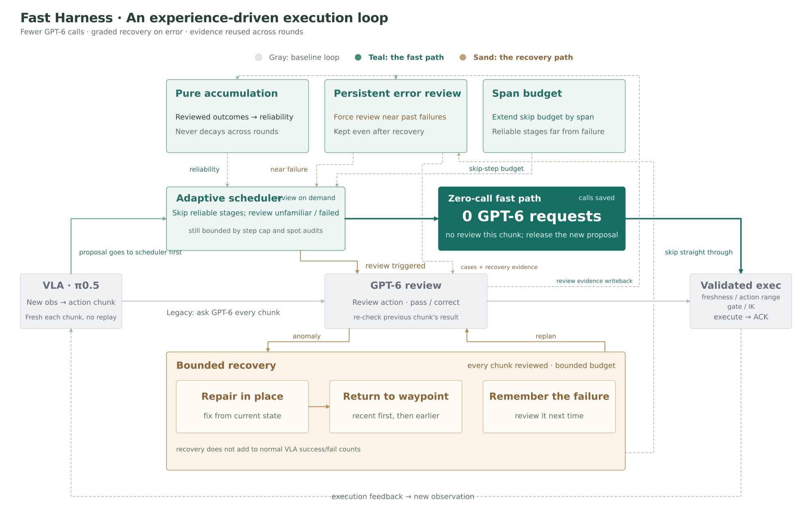
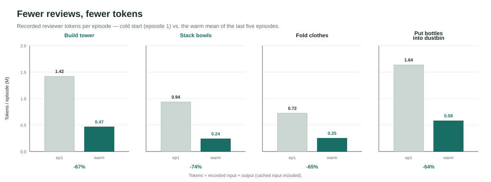

# fast-harness

**A robot policy that learns to skip its own reviews** — teacher calls, tokens and wall-clock
fall with every repetition, while task success holds.

📄 **Project report & results:** https://fastharness.github.io/

The expensive teacher normally checks every action. `fast-harness` accumulates verified
experience across repetitions of a task, so it reviews less each time. Each chunk, it takes a
fresh student proposal and decides — from accumulated experience — whether that chunk needs a
review or can be released on a **zero-call fast path**. Only unfamiliar, risky, or
previously-failed moments pay for a review; errors still trigger bounded recovery to a verified
waypoint. The first episode is reviewed in full by design; from there the number of reviews
falls and the skip rate rises, both leveling off at a stable value.



Nothing is trained. There is no second learned model and no state rollback — only bookkeeping
of verified experience plus a bounded recovery state machine. See
[`docs/DESIGN.md`](docs/DESIGN.md) for the full design, formulas and state machine, and the
[project report](https://fastharness.github.io/) for the measured results.

## Install

Pure standard library; Python 3.10+.

```bash
git clone <this-repo> fast-harness
cd fast-harness
pip install .            # or: pip install -e .
```

The offline demo needs no extra dependencies. The RoboDojo integration needs the optional
extra: `pip install ".[robodojo]"` (NumPy + Pillow).

## Quickstart — the offline demo

The `demo` command runs a fully offline, deterministic symbolic robot: no GPU, no network, no
API key. It contrasts an **all-review baseline** against the **adaptive** harness over a few
repeats of one task.

```bash
python -m fast_harness demo \
  --output   /tmp/fh_demo \
  --memory-dir /tmp/fh_demo_mem \
  --episodes 6 --mode compare
```

Each line is one episode summary (JSON). Every episode reports `native_success: true` in both
modes — the difference is how many reviews it took to get there (`teacher_calls`):

| Episode | baseline `teacher_calls` | adaptive `teacher_calls` | adaptive skip rate |
|---:|---:|---:|---:|
| 1 | 37 | 26 | 31% |
| 2 | 37 | 15 | 61% |
| 3 | 37 | 14 | 64% |
| 4 | 37 | 11 | 72% |
| 5 | 37 | 13 | 67% |
| 6 | 37 | 12 | 69% |

The baseline reviews every chunk forever; the adaptive harness converges to a handful of
reviews per episode once the stages are proven — skipping ~70% of them — while still completing
the task every time. (Numbers above are from a seeded run and are reproducible.)

Other modes: `--mode baseline` or `--mode adaptive` to run just one; `--max-interval` bounds
how many chunks may pass between reviews. To watch the bounded recovery path instead, add
`--fault-episode N` to inject a fault on episode N.

## Reproducing a real task — RoboDojo `build_tower`

The offline demo uses a symbolic backend. To drive a real policy in simulation, `fast-harness
live` connects to a running policy server and a running
[RoboDojo](https://github.com/robodojo-benchmark/RoboDojo) simulation episode, and reviews the
policy's chunks with a real vision-language model over the Responses or Anthropic Messages
protocol.

RoboDojo is an open, eval-only benchmark (Isaac Sim based); the policy server is a separate
component you supply. `fast-harness` vendors neither — it defines the integration contract and
you plug in your runtime.

**Prerequisites**

1. RoboDojo installed, with the `build_tower` task and its assets available, and a simulation
   episode server started.
2. A policy server for your VLA (e.g. a π0.5-class policy) started and reachable on a port.
3. A runtime module importable as `--runtime-module` that exposes two classes wiring the above
   to this harness (see [`docs/DESIGN.md` §10](docs/DESIGN.md)):
   - `PolicyClient(port, checkpoint)` — the action-chunk client (`.metadata`, `.close()`);
   - `RoboDojoTools(rollout_dir, task, policy, sim_port=, seed=, max_decisions=)` — the
     simulator client (with a `.sim.request(name)` RPC channel).
4. A reviewer endpoint and model, with the API key in an environment variable. The key is read
   only from the environment and never logged.

**Run**

```bash
export REVIEW_API_KEY=...            # your key; the env-var name is arbitrary

python -m fast_harness live \
  --task build_tower \
  --checkpoint /path/to/policy/weights \
  --runtime-module robodojo_runtime \
  --upstream /path/to/your/runtime/parent \
  --output  /tmp/build_tower_run \
  --memory  /tmp/build_tower_run/experience.sqlite \
  --student-port 18830 --sim-port 19113 \
  --reviewer responses --model YOUR_MODEL \
  --endpoint "$YOUR_RESPONSES_ENDPOINT" --api-key-env REVIEW_API_KEY \
  --contact-gating --commit-gating --persist-error-review \
  --allow-model-requests
```

- `--reviewer anthropic` instead uses the Messages protocol (`--endpoint …/v1/messages`,
  `--api-key-env ANTHROPIC_API_KEY` by default, `--max-tokens`).
- `--allow-model-requests` is required for any run that contacts the model; without it the
  harness refuses to send images.
- Point `--memory` at a POSIX-local path (SQLite needs a real filesystem, not an object-store
  mount).
- The experience store is keyed by a namespace derived from task + weights + policy config +
  reviewer config, so runs with different setups never share learned experience.

**Establish a baseline first.** For a fair comparison, run the same task, policy, model and
budget once with `--always-review` (a fresh experience store), then again adaptively. Report
native success rate, reviewer calls, real token usage, error-detection latency, recovery
actions and wall-clock. The adaptive run should cut reviewer calls on the later, proven
episodes while holding native success — exactly the trend the offline demo shows.

**Probe.** `python -m fast_harness probe --allow-model-requests --reviewer … --model … --endpoint …`
sends one synthetic review to check connectivity and credentials without touching a robot.

## Results

Across repeated episodes of the same task the trend is consistent: teacher calls fall while
the review-skip rate rises, and both level off. A skipped review is a teacher call that is
never made, so the token cost recorded per episode drops with experience — by **roughly
two-thirds to three-quarters** across the four tasks — and the warm-episode wall-clock falls to
**about a third** of the all-review baseline. Over the same episodes, task success is
maintained and the harness stays competitive with published methods on every task the benchmark
reports. Cold start (episode 1) vs. the warm mean of the last five episodes:



Full methodology, baselines and per-task curves are in the
[project report](https://fastharness.github.io/).

## Tests

Offline, no GPU / network / key:

```bash
python -m unittest discover -s tests -v
```

Some RoboDojo/feature tests self-skip if NumPy or Pillow are not installed.

## License

MIT — see [`LICENSE`](LICENSE). RoboDojo and any policy server you connect are separate
projects under their own licenses.
